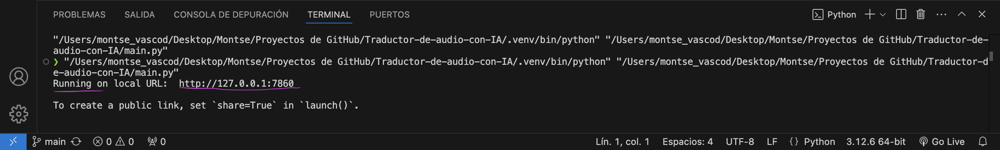

# Traductor de Audio con IA 🤖✨

Este proyecto es una aplicación web que utiliza inteligencia artificial para transcribir y traducir audios a varios idiomas. La aplicación transcribe el audio, detecta automáticamente el idioma original, traduce el texto transcrito a los idiomas seleccionados por el usuario y genera archivos de audio con la traducción correspondiente.

He de agradecer a  [MoureDev](https://youtu.be/oxLvf2nDCvQ?si=8fC2fkEkYl_FwSfc) por compartir sus conocimientos y por ser esa eterna fuente de inspiración.

## Características 🛠️

- **Transcripción de Audio**: Utiliza el modelo [Whisper](https://github.com/openai/whisper) para transcribir audios desde el archivo cargado o desde el propio micrófono del usuario.

- **Traducción**: Traduce el texto transcrito a varios idiomas usando la librería [Translate](https://github.com/terryyin/translate-python).

- **Síntesis de Voz**: Genera archivos de audio para cada idioma traducido utilizando la API de [Google Cloud Text-to-Speech](https://cloud.google.com/text-to-speech/docs/libraries?hl=es-419#client-libraries-install-python).

- **Interfaz Gráfica**: Proporciona una interfaz de usuario para cargar audios, seleccionar idiomas para la traducción, y reproducir los audios traducidos usando [Gradio](https://www.gradio.app/).

- **Sistema de Feedback**: Posee un espacio para dar feedback a nuestro proyecyto.

## Capturas del proyecto 💻

## Interfaz inicial

## Transcripciones 📑

## Inglés

## Francés

## Italiano

## Español

## Interfaz completa

## Ejemplo de Audios Traducidos 💬

## Inglés

- [Primer audio](./Ejemplo%20de%20audios/Traducción%20del%20Italiano/en.mp3)

- [Segundo audio](./Ejemplo%20de%20audios/Traducción%20del%20Francés/en.mp3)

- [Tercer audio](./Ejemplo%20de%20audios/Traducción%20del%20Español/en.mp3)

## Francés

- [Primer audio](./Ejemplo%20de%20audios/Traducción%20del%20Inglés/fr.mp3)
  
- [Segundo audio](./Ejemplo%20de%20audios/Traducción%20del%20Italiano/fr.mp3)
  
- [Tercer audio](./Ejemplo%20de%20audios/Traducción%20del%20Español/fr.mp3)

## Italiano

- [Primer audio](./Ejemplo%20de%20audios/Traducción%20del%20Inglés/it.mp3)
  
- [Segundo audio](./Ejemplo%20de%20audios/Traducción%20del%20Francés/it.mp3)
  
- [Tercer audio](./Ejemplo%20de%20audios/Traducción%20del%20Español/it.mp3)

## Español

- [Primer audio](./Ejemplo%20de%20audios/Traducción%20del%20Inglés/es.mp3)
  
- [Segundo audio](./Ejemplo%20de%20audios/Traducción%20del%20Francés/es.mp3)
  
- [Tercer audio](./Ejemplo%20de%20audios/Traducción%20del%20Italiano/es.mp3)
  

## Contribuciones 🤝

Las contribuciones son bienvenidas. Siéntete libre de hacer un [Fork](https://github.com/Monxiidev/Traductor-de-audio-con-IA/fork) del proyecto, crear una rama, agregar tus cambios y enviar un pull request.

## Instalación ⚙️

### 1. Clona el repositorio

    git clone https://github.com/Monxiidev/Traductor-de-audio-con-IA.git
    cd Traductor-de-audio-con-IA

### 2. Crea y activa un entorno virtual (opcional pero se trata de buenas prácticas así que lo recomiendo encarecidamente, mi nombre para los entornos siempre es ".venv"):

    python3 -m venv .venv
    source .venv/bin/activate
      

### 3. Instala las dependencias:

    pip install -r requirements.txt

### 4. Configura las credenciales de Google Cloud Text-to-Speech. Asegúrate de tener configurada la variable de entorno "GOOGLE_APPLICATION_CREDENTIALS" con el path a tu archivo de credenciales JSON descargado desde Google Cloud Console.

    export GOOGLE_APPLICATION_CREDENTIALS="/path/to/credentials.json"

## Uso 💻

1. Ejecuta la aplicación:

   Yo particularmente uso Visual Studio Code
   
2. Abre tu navegador web e ingresa a la dirección proporcionada por Gradio. (Al ejecutar el Script, la terminal te dará la URL para acceder a la aplicación):

3. Carga un archivo de audio o graba tu voz usando tu micrófono, selecciona los idiomas a los que deseas traducir y haz clic en "Traducir".

## Estructura del Código 🧬

- "main.py": Es el Script principal que define el flujo de la interfaz gráfica y las funciones de transcripción, traducción y síntesis de voz.

- "requirements.txt": Es la lista de dependencias necesarias para instalar y que así el proyecto funcione correctamente.

## Tecnologías Utilizadas ⚡️

- [Python](https://www.python.org): Como lenguaje de programación
- [Gradio](https://www.gradio.app/): Para la interfaz gráfica del usuario.
- [Whisper](https://github.com/openai/whisper): Para la transcripción de audio.
- [Translate](https://github.com/terryyin/translate-python): Para la traducción de texto.
- [Google Cloud Text-to-Speech](https://cloud.google.com/text-to-speech/docs/libraries?hl=es-419#client-libraries-install-python): Para la generación de audio traducido.
- [Langdetect](https://pypi.org/project/langdetect/): Para la detección del idioma del texto.

## Licencia ✅

Este proyecto está licenciado bajo los términos de Apache License 2.0. Ver el archivo [LICENSE](./LICENSE) para más detalles.

## Contacto 📥

Si tienes alguna pregunta o sugerencia, siéntete libre de contactarme directamente 🚀🎉
